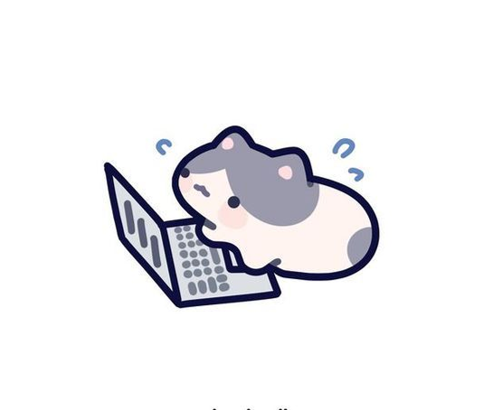

<link href="https://fonts.googleapis.com/css2?family=Poppins:wght@300;400;500;600;700&display=swap" rel="stylesheet">

  

  

<h2 style="margin-bottom:5px; font-family:'Poppins', sans-serif; font-weight:300;">
  ☺︎
   About me
</h2>

<table align="center" style="font-family: 'Poppins', sans-serif;">
  <tr>
    <td width="50%" valign="top">
      <ul style="padding-left:18px; margin-top:6px;">
        <li>💻 I'm a 
      
        Software Developer
      
      who enjoys building web applications.</li>
        <li>🌱 Currently learning & improving skills in 
      
        Web Development
      .</li>
        <li>📍 From Indonesia, living in Bogor.</li>
      </ul>
    </td>
    <td width="45%" align="center">
       
    </td>
  </tr>
</table>
